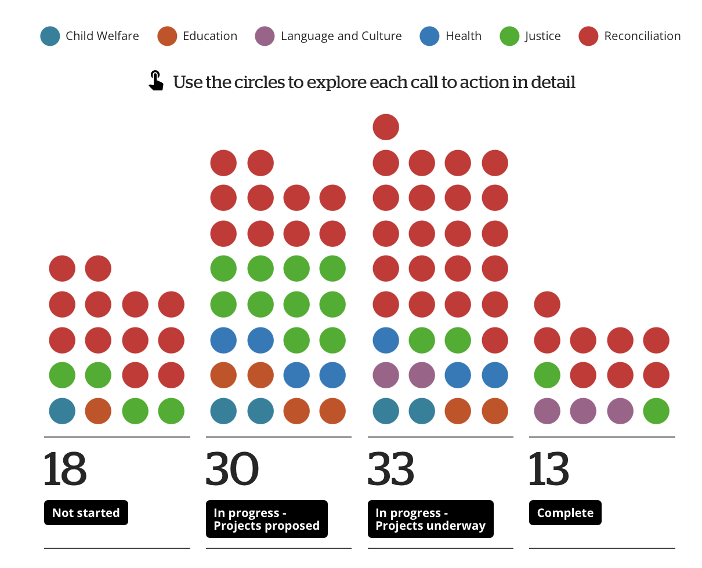
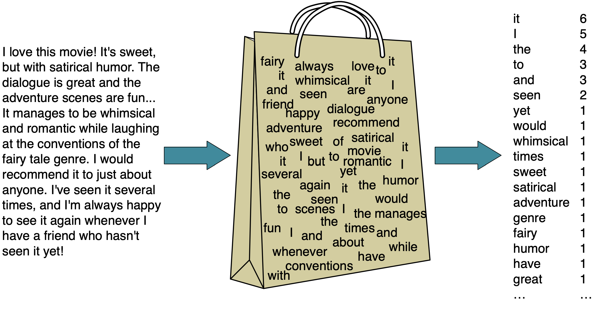
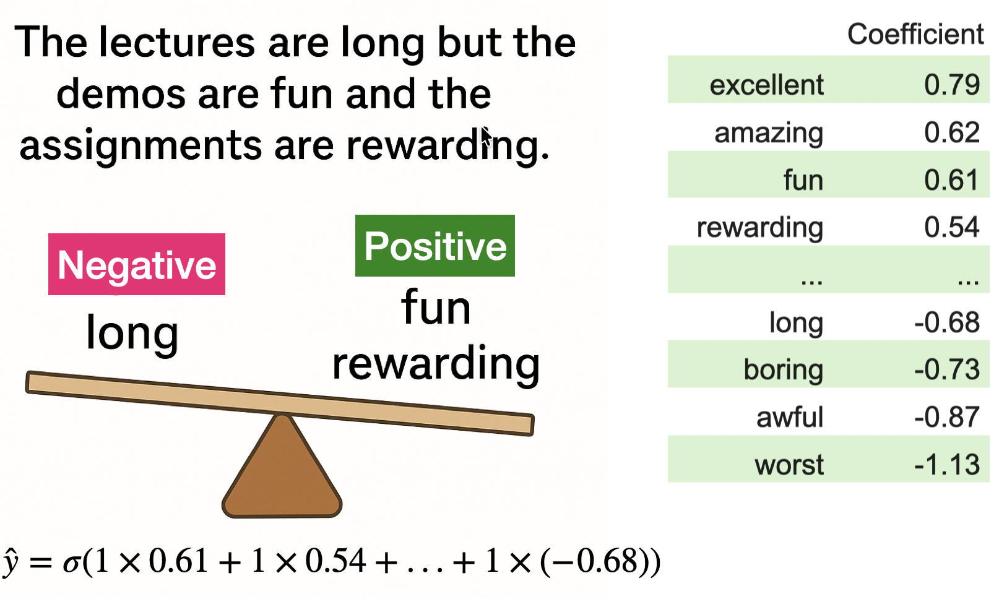

## Announcements

- CPSC 330 Office Hours are now posted on Ed Discussion
- Reminder: Test 1 window is ongoing, so:
  - forums will be closed, 
  - OH are cancelled,
  - Tutorials are still running, but do not cover testable content
- Test 2 & 3 reservations are open!

## Announcements (cont'd)

- Test viewing windows are also open
  - You will need to book a viewing session to review your Tests
  - This is your opportunity to learn from your mistakes and look at the correct answers for the Tests
  - You may also request regrades at this time
- HW 3 and 4 are released!
  - You may work on these in pairs

<!-- - Remember Monday September 30th is a holiday, National Day for Truth and Reconciliation
    - I encourage you to spend some reflecting on the Indigenous peoples of Canada. I invite you to [explore the Beyond 94 project which tracks the progress of the 94 calls to action.](https://www.cbc.ca/newsinteractives/beyond-94)

{.nostretch fig-align="center" width="600px"} -->

## Recap: Dealing with text features 
- Preprocessing text to fit into machine learning models using text vectorization.
- Bag of words representation 


## Recap: `sklearn` `CountVectorizer`
- Use `scikit-learn`’s `CountVectorizer` to encode text data
- `CountVectorizer`: Transforms text into a matrix of token counts
- Important parameters:
  - `max_features`: Control the number of features used in the model 
  - `max_df`, `min_df`: Control document frequency thresholds
  - `ngram_range`: Defines the range of n-grams to be extracted
  - `stop_words`: Enables the removal of common words that are typically uninformative in most applications, such as “and”, “the”, etc.

## (iClicker) Exercise 6.2

Select all of the following statements which are TRUE.

- (A) `handle_unknown="ignore"` would treat all unknown categories equally.
- (B) As you increase the value for `max_features` hyperparameter of `CountVectorizer` the training score is likely to go up.
- (C) Suppose you are encoding text data using `CountVectorizer`. If you encounter a word in the validation or the test split that's not available in the training data, we'll get an error.
- (D) In the code below, inside `cross_validate`, each fold might have slightly different number of features (columns) in the fold.

```python
pipe = (CountVectorizer(), SVC())
cross_validate(pipe, X_train, y_train)
```


## Linear models 

:::: {.columns}

:::{.column width="45%"}
- Linear models make an assumption that the relationship between `X` and `y` is linear. 
- In this case, with only one feature, our model is a straight line.
- What do we need to represent a line?
  - Slope ($w_1$): Determines the angle of the line.
  - Y-intercept ($w_0$): Where the line crosses the y-axis.

:::


::: {.column width="55%"}
```{python}
import matplotlib.pyplot as plt
import numpy as np
# Data
hours_studied = [0.5, 1.0, 2.0, 2.0, 3.5, 4.0, 5.5, 6.0]
grades = [25, 35, 70, 40, 60, 55, 75, 80]

# Convert data to numpy arrays and reshape for model fitting
X = np.array(hours_studied).reshape(-1, 1)
y = np.array(grades)

from sklearn.linear_model import LinearRegression
# Fit a linear regression model
model = LinearRegression()
model.fit(X, y)

# Generate predictions for plotting the regression line
X_range = np.linspace(X.min(), X.max(), 100).reshape(-1, 1)
y_pred = model.predict(X_range)

# Plotting the data points and the regression line
plt.figure(figsize=(8, 4))
plt.scatter(X, y, color='green', edgecolors='black', s=130, label='Data Points')
plt.plot(X_range, y_pred, color='blue', linewidth=2, label='Regression Line')
plt.xlabel('# hours studied')
plt.ylabel('% grade in Quiz 2')
plt.title('Linear Models: Prediction')
plt.legend()
plt.grid(True)
plt.show()
```
- Making predictions: $y_{hat} = w_1 \times \text{\# hours studied} + w_0$

:::
::::

## `Ridge` vs. `LinearRegression`
- Ordinary linear regression is sensitive to **multicolinearity** and overfitting
- Multicolinearity: Overlapping and redundant features. Most of the real-world datasets have colinear features.   
- Linear regression may produce large and unstable coefficients in such cases. 
- `Ridge` adds a parameter to control the complexity of a model. Finds a line that balances fit and prevents overly large coefficients.

## When to use what?
- `LinearRegression`
  - When interpretability is key, and no multicollinearity exists
- `Ridge` 
  - When you have **multicollinearity** (highly correlated features).
  - When you want to prevent **overfitting** in linear models.
- **In this course, we'll use `Ridge`.**

## Logistic regression 
- Suppose your target is binary: pass or fail 
- Logistic regression is used for such binary classification tasks.  
- Logistic regression predicts a probability that the given example belongs to a particular class.
- It uses **Sigmoid function** to map any real-valued input into a value between 0 and 1, representing the probability of a specific outcome.
- A threshold (usually 0.5) is applied to the predicted probability to decide the final class label.  

## Logistic regression: Decision boundary 

:::: {.columns}

:::{.column width="60%"}

```{python}
import matplotlib.pyplot as plt
import numpy as np
from sklearn.linear_model import LogisticRegression

# Data
hours_studied = [0.5, 1.0, 2.0, 2.0, 3.5, 4.0, 5.5, 6.0]
grades = ['fail', 'fail', 'pass', 'fail', 'pass', 'fail', 'pass', 'pass']

# Converting target variable to binary (0: fail, 1: pass)
grades_binary = [1 if grade == 'pass' else 0 for grade in grades]

# Reshape the data to fit the model
X = np.array(hours_studied).reshape(-1, 1)
y = np.array(grades_binary)

# Fit logistic regression model
model = LogisticRegression()
model.fit(X, y)

# Generate a range of hours studied for prediction
X_test = np.linspace(min(hours_studied), max(hours_studied), 100).reshape(-1, 1)

# Predict probabilities
probabilities = model.predict_proba(X_test)[:, 1]

# Find decision boundary (where probability = 0.5)
decision_boundary = X_test[np.isclose(probabilities, 0.5, atol=0.01)][0]

# Plotting
plt.figure(figsize=(8, 5))
plt.scatter(hours_studied, y, color='red', label='0=Fail, 1=Pass')
plt.plot(X_test, probabilities, label='Prediction Probability', color='blue')
plt.axvline(x=decision_boundary, ymin=0, ymax=0.5, color='green', linestyle='--')
plt.hlines(y=0.5, xmin=min(hours_studied), xmax=decision_boundary, color='green', linestyle='--')
plt.xlabel('Hours Studied')
plt.ylabel('Probability of Passing')
plt.title('Logistic Regression Prediction Probabilities')
plt.legend(loc="best", fontsize="small")
plt.grid(True)
plt.show()
```
:::
:::{.column width="40%"}
- Sigmoid Function: $\hat{y} = \sigma(w^\top x_i + b) = \frac{1}{1 + e^{-(w^\top x_i + b)}}$
- The decision boundary is the point on the x-axis where the corresponding predicted probability on the y-axis is 0.5. 
:::

::::

## Sentiment analysis example
:::: {.columns}

:::{.column width="55%"}

:::

:::{.column width="45%"}
- Logistic regression learns **coefficients for each word** from training data.  
- Positive coefficients $\rightarrow$ push prediction toward positive class.  
- Negative coefficients $\rightarrow$ push prediction toward negative class.  
- In this example, positive words (_fun_, _rewarding_) outweigh the negative word (_long_), so the overall sentiment is likely **positive**.  
:::

::::

## Parametric vs. non-Parametric models (high-level)
- Imagine you are training a logistic regression model. For each of the following scenarios, identify how many parameters (weights and biases) will be learned.
- Scenario 1: 100 features and 1,000 examples
- Scenario 2: 100 features and 1 million examples

## Parametric vs. non-Parametric models (high-level)
:::: {.columns}

:::{.column width="50%"}
#### Parametric
- Examples: Logistic regression, linear regression, linear SVM  
- Models with a fixed number of parameters, regardless of the dataset size
- Simple, computationally efficient, less prone to overfitting
- Less flexible, may not capture complex relationships
:::

:::{.column width="50%"}
#### Non parametric
- Examples: KNN, SVM RBF, Decision tree with no specific depth specified 
- Models where the number of parameters grows with the dataset size. They do not assume a fixed form for the functions being learned. 
- Flexible, can adapt to complex patterns
- Computationally expensive, risk of overfitting with noisy data
:::


::::

## (iClicker) Exercise 7.1

Select all of the following statements which are TRUE.

- (A) Increasing the hyperparameter `alpha` of `Ridge` is likely to decrease model complexity.
- (B) `Ridge` can be used with datasets that have multiple features.
- (C) With `Ridge`, we learn one coefficient per training example.
- (D) If you train a linear regression model on a 2-dimensional problem (2 features), the model will learn 3 parameters: one for each feature and one for the bias term.


## (iClicker) Exercise 7.2

Select all of the following statements which are TRUE.

- (A) Increasing logistic regression’s `C` hyperparameter increases model complexity.
- (B) The raw output score can be used to calculate the probability score for a given prediction.
- (C) For linear classifier trained on $d$ features, the decision boundary is a $d-1$-dimensional hyperparlane.
- (D) A linear model is likely to be uncertain about the data points close to the decision boundary.

## Break

Let's take a break!

{fig-align="center"}
/


# (Optional) Multinomial logistic regression 

## Softmax Function for Probabilities

Given an input, the probability that it belongs to class $j \in \{1, 2, \dots, K\}$ is calculated using the **softmax function**:

$P(y = j \mid x_i) = \frac{e^{w_j^\top x_i + b_j}}{\sum_{k=1}^{K} e^{w_k^\top x_i + b_k}}$

- $x_i$ is the $i^{th}$ example 
- $w_j$ is the weight vector for class $j$.
- $b_j$ is the bias term for class $j$.
- $K$ is the total number of classes.


## Making Predictions

1. **Compute Probabilities**:  
   For each class $j$, compute the probability $P(y = j \mid x_i)$ using the softmax function.

2. **Select the Class with the Highest Probability**:  
   The predicted class $\hat{y}$ is:  
   $\hat{y} = \arg \max_{j \in \{1, \dots, K\}} P(y = j \mid x_i)$


## Binary vs multinomial logistic regression 

|   **Aspect**                       | **Binary Logistic Regression**              | **Multinomial Logistic Regression**  |
|--------------------------|---------------------------------------------|--------------------------------------|
| **Target variable**      | 2 classes (binary)                          | More than 2 classes (multi-class)    |
| **Getting probabilities**  | Sigmoid                                   | Softmax                              |
| parameters               | $d$ weights, one per feature and the bias term | $d$ weights and a bias term per class |  
| **Output**               | Single probability                          | Probability distribution over classes |
| **Use case**             | Binary classification (e.g., spam detection) | Multi-class classification (e.g., flower species) |

## Coming up

A few big questions remain:

- How do we tune hyperparameters?
- How do we choose our features? (feature selection, dimensionality reduction, regularization etc.)
- How do we come up with new useful features (feature engineering)
- How do we choose between different models? (different evaluation metrics, what happens if we're not happy with our test error?)
- How to deal with class imbalance?
- What do we do if we do not have targets (unsupervised learning)
- How to build models for more interesting data such as images, user preferences, or sequential data?)

## Group Work: Class Demo & Live Coding

For this demo, each student should [click this link](https://github.com/new?template_name=lecture07_demo&template_owner=ubc-cpsc330) to create a new repo in their accounts, then clone that repo locally to follow along with the demo from today.