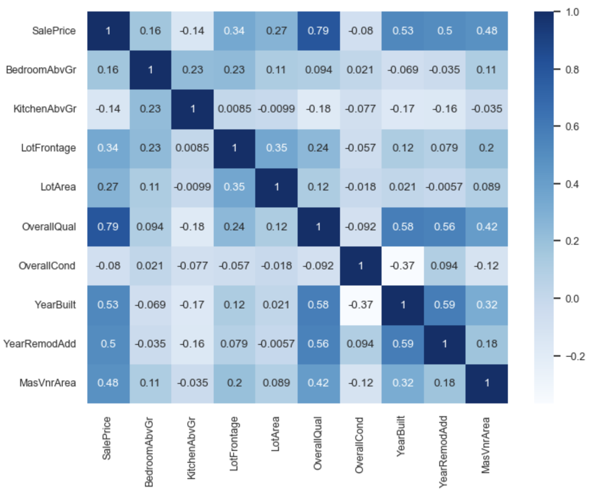
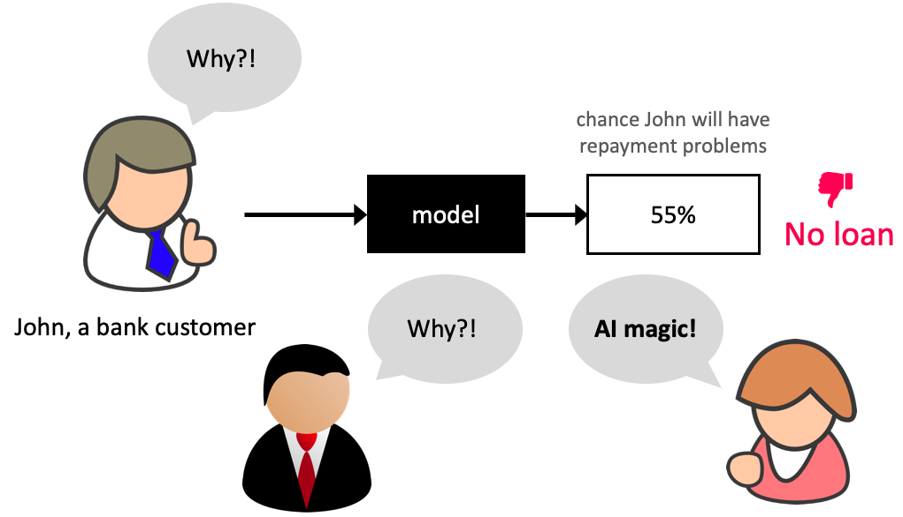
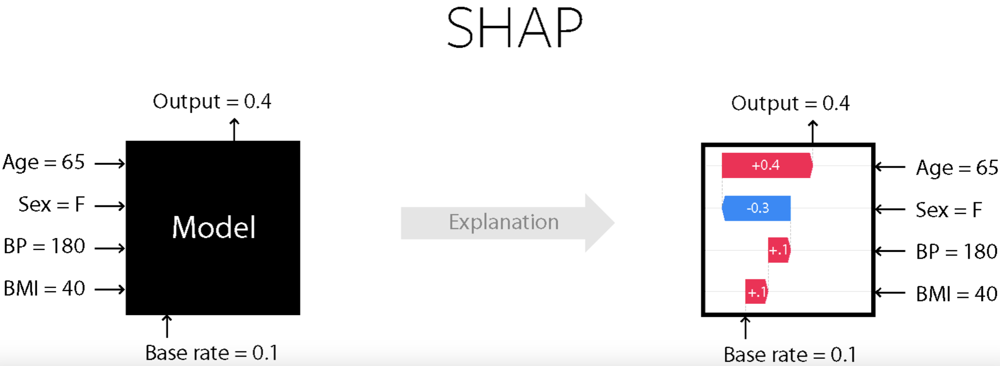
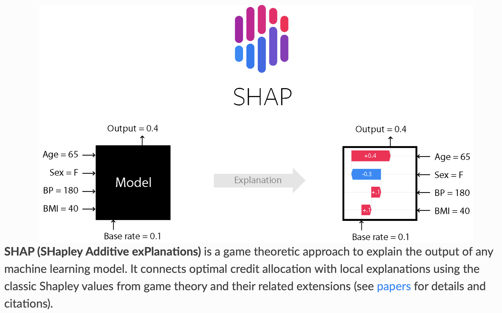
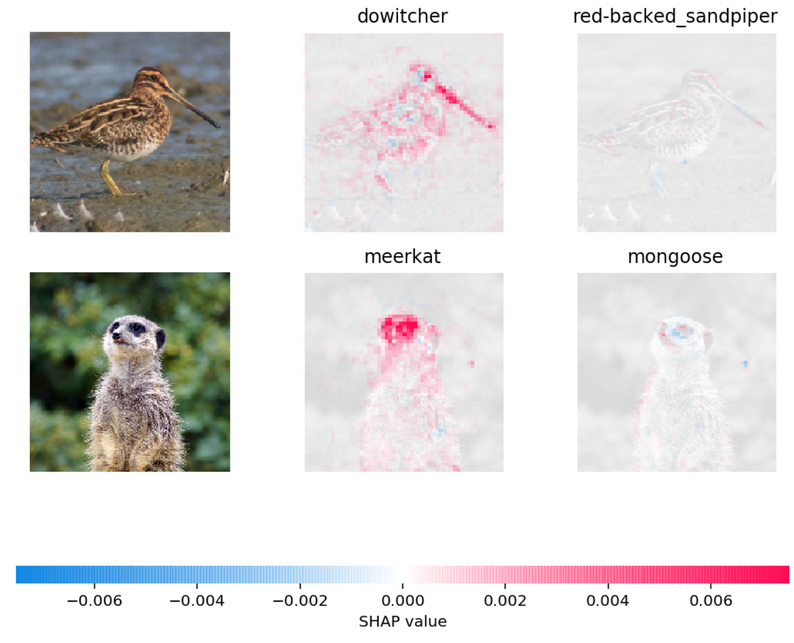

## Announcements 

<!--

## Midterm Debrief

How did you feel about the first midterm?

- (A) I felt well-prepared and it went smoothly
- (B) I think it went okay. We'll see when grades come back
- (C) I struggled and didn't feel fully prepared
- (D) I noticed some gaps between what we practiced and what appeared on the exam
- (E) It was a stressful experience for me 😔

- HW4 grades are released 
- HW5 is due next week Monday. Make use of office hours and tutorials this week.    -->

## Motivating Feature importances

In the next few slides, consider the two scenarios and decide which model you would pick given the circumstances described.

## Scenario 1: Which model would you pick?

Predicting whether a patient is likely to develop diabetes based on features such as age, blood pressure, glucose levels, and BMI. You have two models:

- LGBM which results in 0.9 f1 score 
- Logistic regression which results in 0.84 f1 score

Which model would you pick? Why? 

## Scenario 1: Which model would you pick?

Predicting whether a user will purchase a product next based on their browsing history, previous purchases, and click behavior. You have two models:

- LGBM which results in 0.9 F1 score
- Logistic regression which results in 0.84 F1 score

Which model would you pick? Why? 

## Transparency

- In many domains understanding the **relationship between features and predictions** is critical for trust and regulatory compliance. 

### Feature importances 

- How does the output depend upon the input? 
- How do the predictions change as a function of a particular feature?

# How to get feature importances? 

## Correlations
:::: {.columns}

::: {.column width="60%"}

:::

::: {.column width="40%"}
- What are some limitations of correlations? 
:::
::::

## Interpreting coefficients 
- Linear models are interpretable because you get coefficients associated with different features. 
- Each coefficient represents the estimated impact of a feature on the target variable, assuming all other features are held constant.
- In a `Ridge` model, 
  - A positive coefficient indicates that as the feature's value increases, the predicted value also increases.
	- A negative coefficient indicates that an increase in the feature's value leads to a decrease in the predicted value.

## Interpreting coefficients 

- When we have different types of preprocessed features, what challenges you might face in interpreting them? 
  - Ordinally encoded features
  - One-hot encoded features
  - Scaled numeric features

## Break

Let's take a break!

{fig-align="center"}

## Pause and Reflect 

We are now just over half-way through CPSC 330!

You had a midterm already a couple of weeks ago, I'd like some feedback on how things are going in class (as the instructor).

## Class Survey

I'd love to hear how you think lectures are going, and how the course is going overall: [bit.ly/cpsc330_2026S1](https://bit.ly/cpsc330_2026S1).

Let's take a couple of minutes to complete this before we get started on today's content.

## Group Work: Class Demo & Live Coding

For this demo, each student should [click this link](https://github.com/new?template_name=lecture12_demo&template_owner=ubc-cpsc330) to create a new repo in their accounts, then clone that repo locally to follow along with the demo from today.

<!-- 
## (iClicker) Midterm poll {.smaller}

**Select all of the following statements which are TRUE.**

- (A) I'm happy with my progress and learning in this course.
- (B) I find the course content interesting, but the pace is a bit overwhelming. Balancing this course with other responsibilities is challenging
- (C) I'm doing okay, but I feel stressed and worried about upcoming assessments.
- (D) I'm confused about some concepts and would appreciate more clarification or review sessions.
- (E) I'm struggling to keep up with the material. I am not happy with my learning in this course and my morale is low ☹️.
 -->

## Finishing up Feature importances and motivating SHAP

Why do we care about feature importances so much?

- Identify features that are not useful and maybe remove them.
- Get guidance on what new data to collect.
  - New features related to useful features -> better results.
  - Don’t bother collecting useless features -> save resources.

## Finishing up Feature importances

- Help explain why the model is making certain predictions.
  - Debugging, if the model is behaving strangely.
  - Regulatory requirements.
  - Fairness / bias. See this.
  - Keep in mind this can be used on deployment predictions!

## Why bother about model transparancey? 

## SHAP 

## SHAP intuition 
- Think of the model as a "black box" that outputs predictions.
- SHAP asks: If we treat each feature as a player contributing to the final prediction, how much credit does each one deserve?
- To answer this fairly, SHAP looks at all possible combinations of features and averages their marginal contributions.
- A marginal contribution is how much the prediction changes when you add that feature to a subset of other features.

## SHAP

{fig-align="center"}

## Extending SHAP

- Can also be used to explain text classification and image classification!

## Extending SHAP 

    
[Source](https://github.com/slundberg/shap)

## Extending SHAP

- Example: In the picture below, red pixels represent positive SHAP values that increase the probability of the class, while blue pixels represent negative SHAP values the reduce the probability of the class.

## Practice Question on SHAP {.smaller}

Select all the statements that are true:

- (A) SHAP values are model parameters learned during training.
- (B) Coefficients in a linear model and SHAP values both quantify how much each feature contributes to a prediction, but coefficients are global while SHAP values are local.
- (C) SHAP values can only be computed for tree-based models.
- (D) A waterfall plot shows how each feature's SHAP value cumulatively contributes to a single prediction.
- (E) SHAP provides the same explanation for all examples in the dataset.