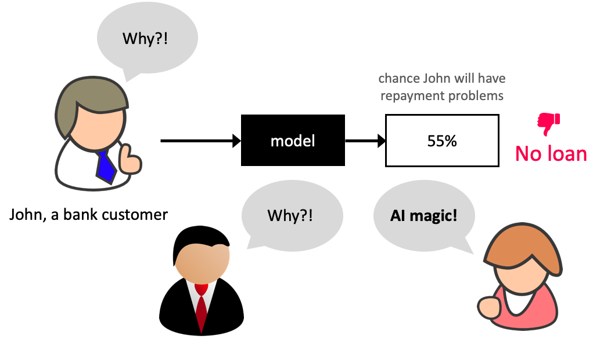
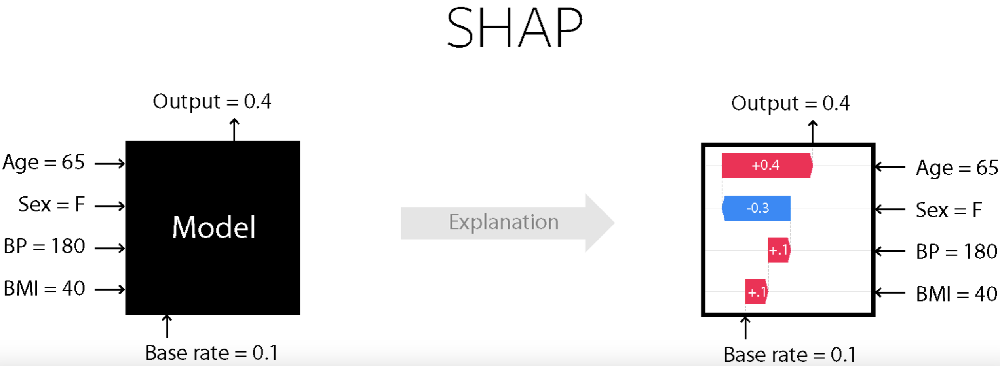
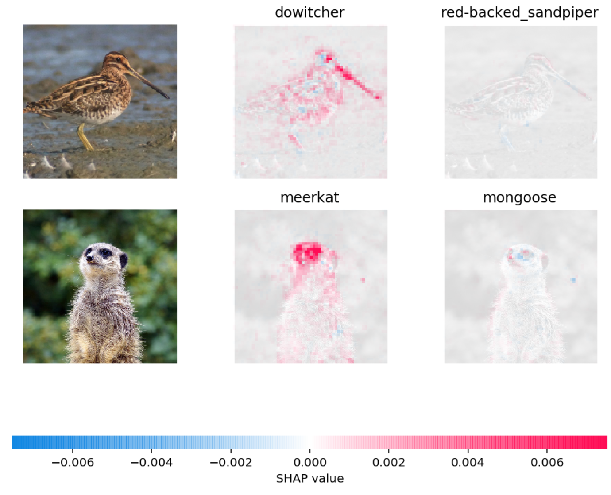
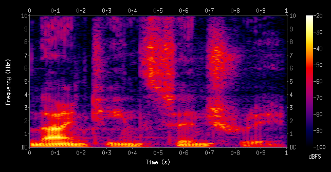
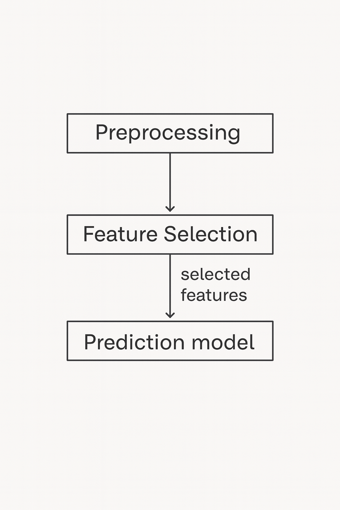

## Finishing up Feature importances and SHAP

Why do we care about feature importances so much?

- Identify features that are not useful and maybe remove them.
- Get guidance on what new data to collect.
  - New features related to useful features -> better results.
  - Don’t bother collecting useless features -> save resources.

## Finishing up Feature importances

- Help explain why the model is making certain predictions.
  - Debugging, if the model is behaving strangely.
  - Regulatory requirements.
  - Fairness / bias. See this.
  - Keep in mind this can be used on deployment predictions!

## Why bother about model transparancey? 

## SHAP intuition 
- Think of the model as a "black box" that outputs predictions.
- SHAP asks: If we treat each feature as a player contributing to the final prediction, how much credit does each one deserve?
- To answer this fairly, SHAP looks at all possible combinations of features and averages their marginal contributions.
- A marginal contribution is how much the prediction changes when you add that feature to a subset of other features.

## SHAP 

## Extending SHAP

- Can also be used to explain text classification and image classification!

## Extending SHAP 

    
[Source](https://github.com/slundberg/shap)

## Extending SHAP

- Example: In the picture below, red pixels represent positive SHAP values that increase the probability of the class, while blue pixels represent negative SHAP values the reduce the probability of the class.

## Practice Question on SHAP {.smaller}

Select all the statements that are true:

- (A) SHAP values are model parameters learned during training.
- (B) Coefficients in a linear model and SHAP values both quantify how much each feature contributes to a prediction, but coefficients are global while SHAP values are local.
- (C) SHAP values can only be computed for tree-based models.
- (D) A waterfall plot shows how each feature's SHAP value cumulatively contributes to a single prediction.
- (E) SHAP provides the same explanation for all examples in the dataset.

## Break

Let's take a break!

{fig-align="center"}

## Clicker Question 14.0

Suppose you are working on a machine learning project. If you have to prioritize one of the following in your project which of the following would it be?

(A) The quality and size of the data
(B) Most recent deep neural network model
(C) Most recent optimization algorithm

# Feature engineering motivation 

## Discussion question
- Suppose we want to predict whether a flight will arrive on time or be delayed. We have a dataset with the following information about flights:
    - Departure Time
    - Expected Duration of Flight (in minutes)

Upon analyzing the data, you notice a pattern: flights tend to be delayed more often during the evening rush hours. What feature could be valuable to add for this prediction task?
    

## Motivating Feature Engineering

Questions:

- What are two possible ways we could "engineer" features?
    - Think broadly and philosophically rather than an implementation...

## Garbage in, garbage out.

- Model building is interesting. But in your machine learning projects, you'll be spending more than half of your time on data preparation, feature engineering, and transformations.
- The _quality_ of the data is important. Your model is only as good as your data. 

## Activity: Measuring quality of the data

- What are some properties of "good" or "bad" data?
- Along what possible dimensions could we "measure" goodness of data?

| Dimension | Good Data | Bad Data | metric to measure |
| --------- | --------- | -------- | ----------------- |
| | |||
| | |||

## What is feature engineering?  

<blockquote>
<b>Feature engineering</b> is the process of transforming raw data into features that better represent the underlying problem to the predictive models, resulting in improved model accuracy on unseen data.  
- [Jason Brownlee](https://machinelearningmastery.com)
</blockquote> 

- Better features: more flexibility, higher score, we can get by with simple and more interpretable models. 
- If your features, i.e., representation is bad, whatever fancier model you build is not going to help.

## Some quotes on feature engineering 

A quote by Pedro Domingos [A Few Useful Things to Know About Machine Learning](https://homes.cs.washington.edu/~pedrod/papers/cacm12.pdf)

<blockquote>
... At the end of the day, some machine learning projects succeed and some fail. What makes the difference? Easily the most important factor is the features used. 
</blockquote>

## Some quotes on feature engineering 
A quote by Andrew Ng, [Machine Learning and AI via Brain simulations](https://ai.stanford.edu/~ang/slides/DeepLearning-Mar2013.pptx)

<blockquote>
Coming up with features is difficult, time-consuming, requires expert knowledge. "Applied machine learning" is basically feature engineering.
</blockquote>

## Better features usually help more than a better model {.smaller}
- Good features would ideally:
    - capture most important aspects of the problem
    - allow learning with few examples 
    - generalize to new scenarios.

- There is a trade-off between simple and expressive features:
    - With simple features overfitting risk is low, but scores might be low.
    - With complicated features scores can be high, but so is overfitting risk.

## The best features may be dependent on the model you use {.smaller}

- Examples:
    - For counting-based methods like decision trees separate relevant groups of variable values
        - Discretization makes sense 
    - For distance-based methods like KNN, we want different class labels to be "far".
        - Standardization 
    - For regression-based methods like linear regression, we want targets to have a linear dependency on features.

## Domain-specific transformations

In some domains there are natural transformations to do:

- Spectrograms (sound data)
- Convolutions (image data)

[Source](https://en.wikipedia.org/wiki/Spectrogram) 

## Group Work: Class Demo & Live Coding

For this demo, each student should [click this link](https://github.com/new?template_name=lecture13_demo&template_owner=ubc-cpsc330) to create a new repo in their accounts, then clone that repo locally to follow along with the demo from today.

## Break

Let's take a break!

{fig-align="center"}

## Domain-specific transformations

In some domains there are natural transformations to do:
- Spectrograms (sound data)
- Wavelets (image data)
- Convolutions 

[Source](https://en.wikipedia.org/wiki/Spectrogram) 

## Developing intuition about Feature Engineering

...

## Discussion question

- Suppose we want to predict whether a flight will arrive on time or be delayed. We have a dataset with the following information about flights:
    - Departure Time
    - Expected Duration of Flight (in minutes)

Upon analyzing the data, you notice a pattern: flights tend to be delayed more often during the evening rush hours. What feature could be valuable to add for this prediction task?
    

## Clicker Question 13.1 

**Select all of the following statements which are TRUE.**

- (A) Simple association-based feature selection approaches do not take into account the interaction between features.
- (B) You can carry out feature selection using linear models by pruning the features which have very small weights (i.e., coefficients less than a threshold).
- (C) The order of features removed given by `rfe.ranking_` is the same as the order of original feature importances given by the model.

## Feature selection pipeline

##  Two useful methods 

- Model-based selection
    - Use a supervised machine learning model to judge the importance of each feature.
    - Keep only the most important once.
- Recursive feature elimination 
    - Build a series of models
    - At each iteration, discard the least important feature according to the model. 

## (iClicker) Exercise 13.2

**Select all of the following statements which are TRUE.**

- (A) You can carry out feature selection using linear models by pruning the features which have very small weights (i.e., coefficients less than a threshold).
- (B) The order of features removed given by `rfe.ranking_` is the same as the order of original feature importances given by the model.

## Group Work: Class Demo & Live Coding (if time permits)

For this demo, each student should [click this link](https://github.com/new?template_name=lecture13_demo&template_owner=ubc-cpsc330) to create a new repo in their accounts, then clone that repo locally to follow along with the demo from today.
