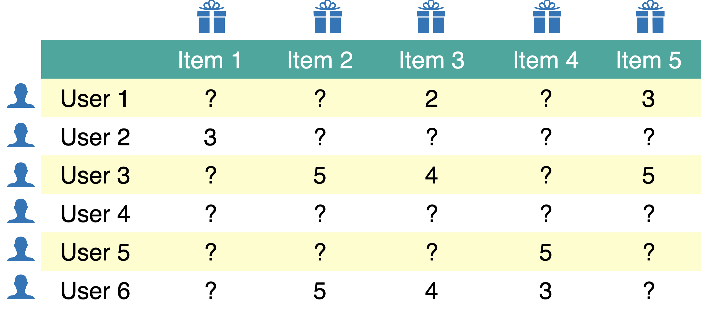
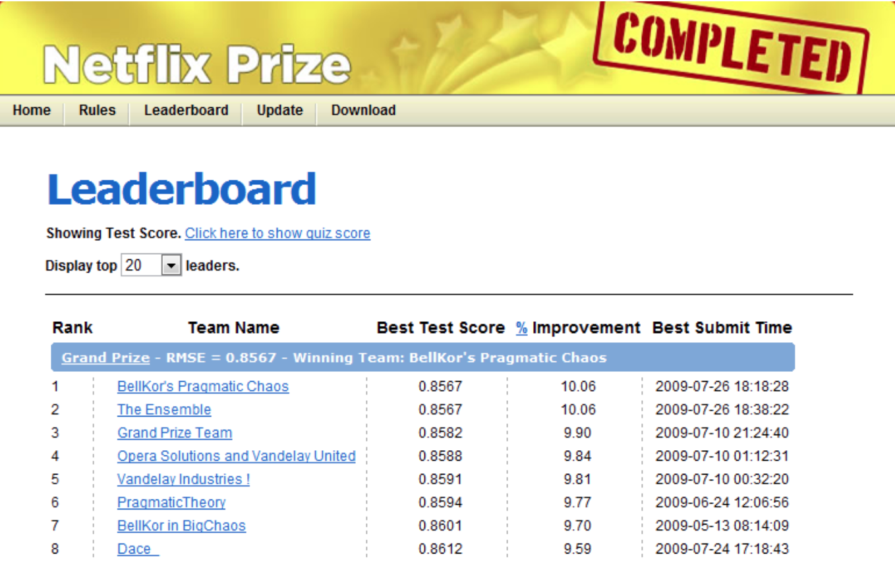
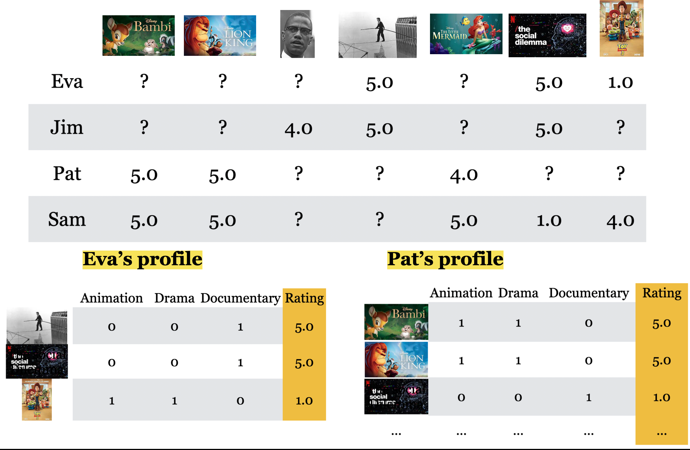

## Announcements 
<!-- 
- Midterm 2 Information post is out!
   HW6 is due tonight at 10 PM. 
    - Computationally intensive (welcome to real-life ML!)
    - heads up: you will need to install many packages  (welcome to real-life ML!)
- HW7 is due Saturday June 14th (remember: content of this is covered in Midterm 2)
- Midterm 2 is this week (Nov 14/15)
  - No Tutorials after Wednesday at 10 AM.
  - Forums will be closed after class on Wednesday
- Reminder: Please double check your Midterm 2 CBTF booking!
- Midterm 2 Practice Questions will be out later today
- Learning Log 4 will be out later today 
-->

## Show of Hands 💡 

What percentage of watch time on YouTube do you think comes from recommendations?

- (A) 30%
- (B) 40%
- (C) 60%
- (D) 70%
- (E) 90%

Based on [YouTube Product Chief at CES 2024](https://www.cnet.com/tech/services-and-software/youtube-ces-2018-neal-mohan/). The number may have changed since then!

## What is a recommendation system? 

A recommendation system suggests products, services, or content that a user is likely to consume or enjoy.

## Example: Recommender systems

- A user visits Amazon to shop.
- Amazon knows:
  - what the user viewed or purchased before
  - what similar users bought
- **The goal:** recommend items that maximize user engagement or sales.
- There's no single "right" label. The goal is to model user behaviour.

## Why should we care? 
:::: {.columns}

::: {.column width="50%"}

:::

::: {.column width="50%"}
- Recommendations shape almost everything we buy or watch.
- Central to the success of companies like Amazon, Netflix, YouTube, and Spotify.
:::
::::

## Why recommendation systems? {.smaller}

- They help users navigate information overload.
- Without them, finding the right item would require sifting through thousands of options.
- Recommendations reduce effort and improve user experience.

{.nostretch fig-align="center" width="400px"}

## The other side: Filter bubbles 
- Recommenders often amplify what users already like or what similar users like.
- This can create filter bubbles, limiting exposure to diverse content.
- Probably harmless in shopping, but can have **serious consequences in domains like news, politics, or science, where diverse viewpoints matter**.

# Data and problem setup 

## What data do we need?

To build a recommender, we typically use:

- User–item interactions (ratings, clicks, views, purchases)
- Item or user features (e.g., genre, price, age)
- Historical data (purchase or viewing history)

## Problem formulation

- We have $N$ users and $M$ items.
- Observed data = interactions:
	- Movie ratings (Netflix)
	- Song plays (Spotify)
	- Product purchases (Amazon)

**Goal**: predict unobserved interactions.

## The utility matrix
- Rows = users, columns = items
- Each entry $y_{ij}$ = user $i$'s interaction (e.g., rating) with item $j$

<!--   -->

## Sparsity
- The utility matrix is mostly empty.
- Each user interacts with only a small fraction of all items.
- Examples:
  - Netflix users rate only a few shows out of thousands.
  - Amazon shoppers review only a handful of products.

## What do we predict?

We aim to fill in the missing entries. In other words, predict ratings or preferences the user hasn't expressed yet.

## Rating prediction $\neq$ regression 
::: {.columns}

::: {.column width="50%"}

### Regression

$$
\begin{bmatrix} 
\checkmark & \checkmark & \checkmark  & \checkmark & \checkmark\\
\checkmark & \checkmark & \checkmark  & \checkmark & \checkmark\\
\checkmark & \checkmark & \checkmark  & \checkmark & \checkmark\\
\checkmark & \checkmark & \checkmark  & \checkmark & ?\\
\checkmark & \checkmark & \checkmark  & \checkmark & ?\\
\checkmark & \checkmark & \checkmark  & \checkmark & ?\\
\end{bmatrix}
$$
:::

::: {.column width="50%"}

### Rating prediction

$$
\begin{bmatrix} 
? & ? & \checkmark  & ? & \checkmark\\
\checkmark & ? & ?  & ? & ?\\
? & \checkmark & \checkmark  & ? & \checkmark\\
? & ? & ?  & ? & ?\\
? & ? & ? & \checkmark & ?\\
? & \checkmark & \checkmark  & ? & \checkmark
\end{bmatrix}
$$
:::
::::

## Main approaches {.smaller}

- Collaborative filtering
    - "Unsupervised" learning 
    - We only have labels $y_{ij}$ (rating of user $i$ for item $j$). 
    - We learn latent features.  
- **Content-based recommenders** (today's focus)
    - Supervised learning
    - Extract features $x_i$ of users and/or items building a model to predict rating $y_i$ given $x_i$. 
    - Apply model to predict for new users/items. 
- Hybrid 
    - Combining collaborative filtering with content-based filtering

# Evaluating Recommender Systems

## How do we evaluate recommendations?

- Is there a **single correct answer** for what should be recommended or what rating should be predicted?  
  - **Not really!**
- Still, we need ways to **compare different methods** and measure their usefulness.

## Why evaluation matters? 

- We'll experiment with different ways to **fill in missing entries** in the utility matrix.  
- Even though recommendations are subjective, we still need **quantitative metrics** to judge:
  - How well do our predictions match real user behavior?  
  - Which model performs better?

## RMSE for rating prediction {.smaller}

- RMSE, which measures how close predicted ratings are to actual ratings, is one of the commonly used metric to evaluate recommendation systems  
- In **2006**, Netflix launched the **Netflix Prize** competition.  
- They released a dataset of **100 million movie ratings** and offered **$1 million** to the first team that improved Netflix’s existing algorithm by **at least 10% in RMSE** on a held-out test set.

{.nostretch fig-align="center" width="400px"}

[Source: Netflix Tech Blog](https://netflixtechblog.com/netflix-recommendations-beyond-the-5-stars-part-1-55838468f429)

## Clicker 16.1 {.smaller}
Select all of the following statements which are **True** 

- (A) In the context of recommendation systems, the shapes of validation utility matrix and train utility matrix are the same. 
- (B) RMSE perfectly captures what we want to measure in the context of recommendation systems. 
- (C) It would be reasonable to impute missing values in the utility matrix by taking the average of the ratings given to an item by similar users.  
- (D) In KNN type imputation, if a user has not rated any items yet, a reasonable strategy would be recommending them the most popular item. 

## Clicker 16.2 {.smaller}

Select all of the following statements which are **True**

(A) In content-based filtering we leverage available item features in addition to similarity between users.
(B) In content-based filtering you represent each user in terms of known features of items.
(C) In the set up of content-based filtering we discussed, if you have a new movie, you would have problems predicting ratings for that movie.
(D) In content-based filtering if a user has a number of ratings in the training utility matrix but does not have any ratings in the validation utility matrix then we won't be able to calculate RMSE for the validation utility matrix.

## Baseline approaches 

- Global average baseline
- Per-user average baseline
- Per-item average baseline
- Average of 2 and 3
    - Take an average of per-user and per-item averages. 
- [$k$-Nearest Neighbours imputation](https://scikit-learn.org/stable/modules/generated/sklearn.impute.KNNImputer.html)    

## Content-based filtering 

{.nostretch fig-align="center" width="900px"}

### iClicker {.smaller}

Select all of the following statements which are **True** 

- (A) In content-based filtering we leverage available item features in addition to similarity between users.
- (B) In content-based filtering you represent each user in terms of **known** features of items.
- (C) In the set up of content-based filtering we discussed, if you have a new movie, you would have problems predicting ratings for that movie. 
- (D) In content-based filtering if a user has a number of ratings in the training utility matrix but does not have any ratings in the validation utility matrix then we won't be able to calculate RMSE for the validation utility matrix.

## Ethics of Recommender Systems

We should be very mindful of the drawbacks of relying on recommender systems.

**What are some ethical considerations of recommender systems?**

## What comprises a recommender system?

What does the problem formulation look like?

What tools would/should we use to create a recommender system?

## Group Work: Class Demo & Live Coding

For this demo, each student should [click this link](https://github.com/new?template_name=lecture16_demo&template_owner=ubc-cpsc330) to create a new repo in their accounts, then clone that repo locally to follow along with the demo from today.

All credit to Dr. Varada Kolhatkar for putting this together!