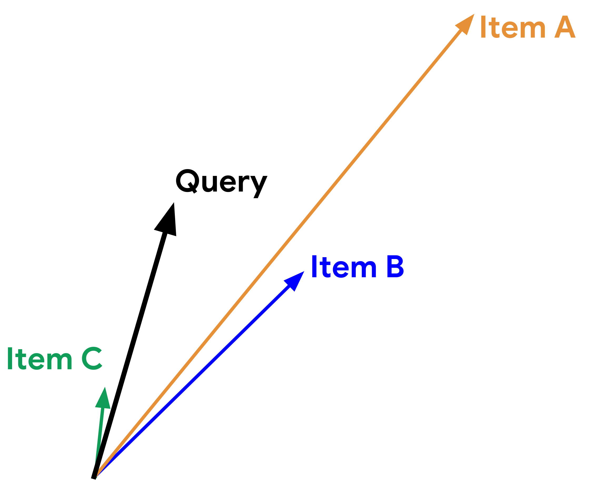
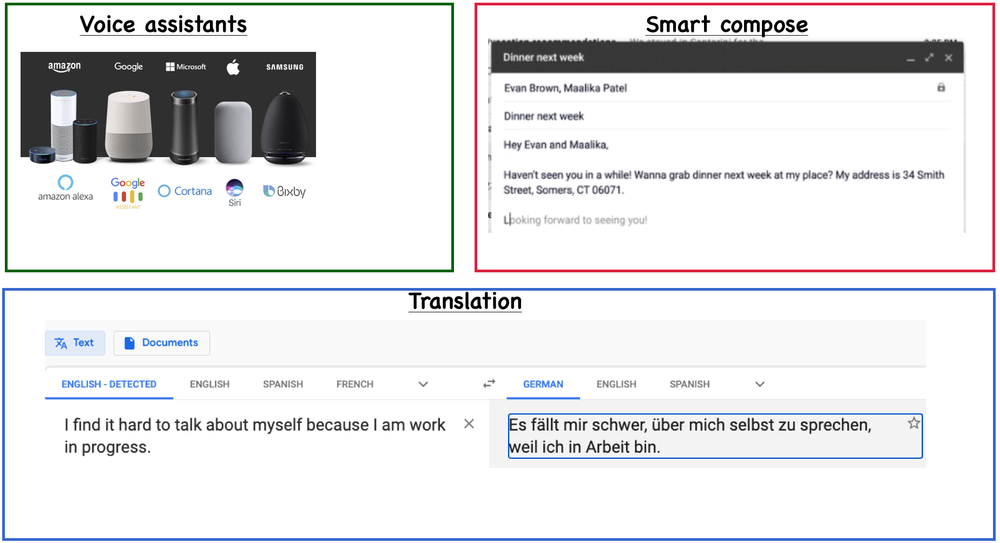
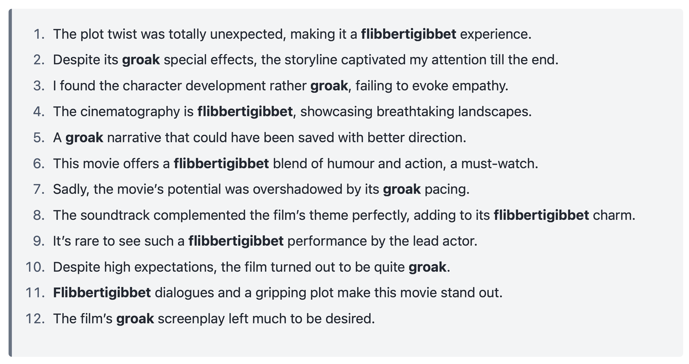

<!-- 
## Announcements 

- Midterm 2 is next week (Nov 14/15)
- More information on Midterm 2, including a practice midterm will be released later tonight
- Reminder: Please double check your Midterm 2 CBTF booking!
 -->

<!-- 
## Similarity metrics {.smaller}
- Similarity based on Euclidean distance

$$distance(vec1, vec2) = \sqrt{\sum_{i =1}^{n} (vec1_i - vec2_i)^2}$$ 

- Dot product similarity: 

$$similarity_{dot product}(vec1,vec2) = vec1.vec2$$

- Cosine similarity: normalized version of dot product. 

$$similarity_{cosine}(vec1,vec2) = \frac{vec1.vec2}{\left\lVert vec1\right\rVert_2 \left\lVert vec2\right\rVert_2}$$
 -->

## Which metric in what context? {.smaller}

::: {.columns}

::: {.column width="50%"}
Given a query vector "Query" in the picture below and the three item vectors, determine the ranking of the items for the three similarity measures below: 

 
:::
::: {.column width="50%"}
- Example: Similarity based on Euclidean distance: item B > item C > item A
  
- **Similarity based on dot product: ?**
  
**- Cosine similarity: ?** 

  

Adapted from [here](https://developers.google.com/machine-learning/recommendation/overview/candidate-generation).
:::
::::

    

## What is NLP?

- **Natural Language Processing (NLP)** is a field at the intersection of **computer science, linguistics, and artificial intelligence**.  
- It focuses on enabling computers to understand, interpret, and generate human language.

## Examples of NLP applications

## Key challenges in NLP

- **Ambiguity**: words can have multiple meanings and meaning depends on previous words/sentences
  - I had toast with _jam_ vs We got stuck in a traffic _jam_.
  - If the **baby** does not thrive on raw **milk**, boil **it**.  
- **Structure**: syntax and grammar vary widely
  - Time flies like an arrow vs Fruit flies like a banana.   
- **World knowledge**: understanding beyond text
  - Olive oil: oil **made from** olives 
  - Baby oil: oil **made for** babies 

## Goal of this lecture

NLP is a broad field. In this lecture I'll give you a high-level introduction to 

- Topic Modeling
- Word embeddings 

We will look at Large Language Models (LLM) next class!

## Activity: Context and word meaning

Pair up with the person next to you and try to guess the meanings of two made-up words: `flibbertigibbet` and `groak`.

Attribution: Thanks to ChatGPT 4o on Wed Nov. 6, 2024!

<!-- ## Group Work: Class Demo & Live Coding

For this demo, each student should [click this link](https://github.com/new?template_name=lecture17_demo&template_owner=ubc-cpsc330) to create a new repo in their accounts, then clone that repo locally to follow along with the demo from today.
-->
